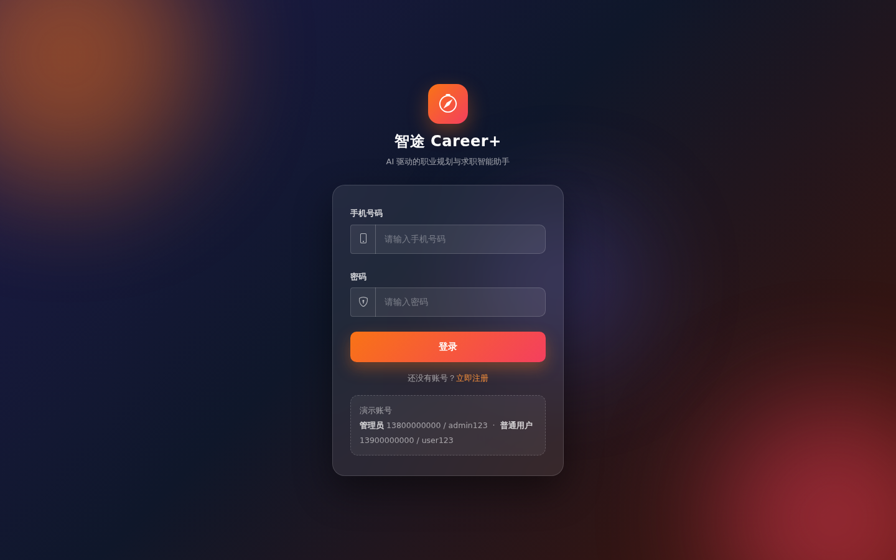
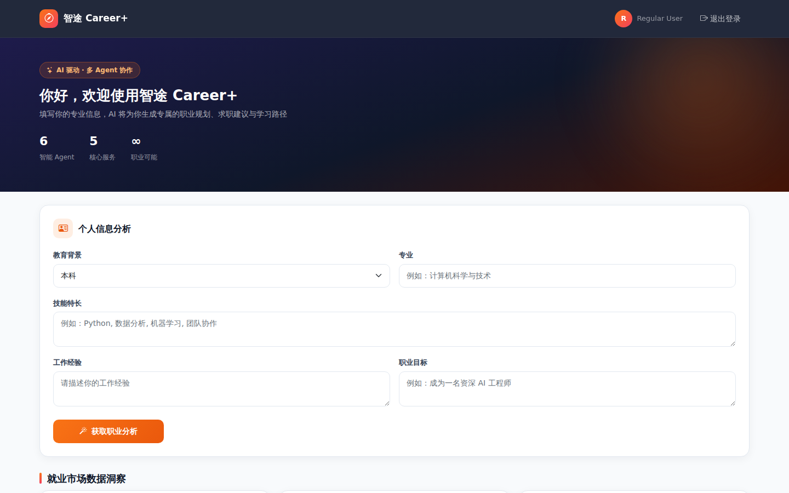
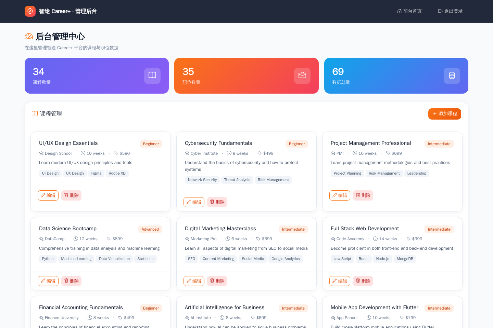
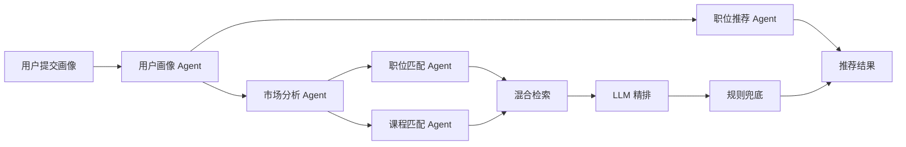
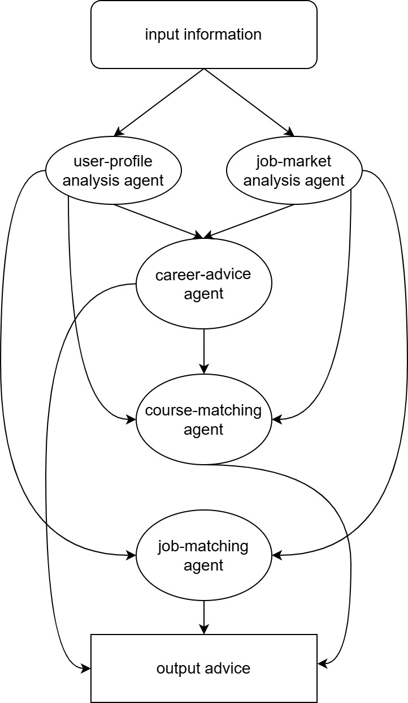

<div align="center">

# 🧭 智途 Career+ · ZhituCareer+

**AI 驱动的职业规划与求职智能助手**

基于 **Flask + 多 Agent 协作（LLM + Playwright 实时市场分析）** 打造的一站式职业分析平台，
提供职业路径分析、职位智能匹配与课程学习推荐。


<br>

**⭐ 如果这个项目对你有帮助，欢迎 Star 支持！**

</div>

---

## ✨ 特性一览

| 特性 | 说明 |
| --- | --- |
| 🎯 **职业路径分析** | 基于个人画像与实时市场数据，生成专属职业发展方向 |
| 💼 **职位智能匹配** | 结合技能与搜索偏好，从职位库中匹配最合适的工作 |
| 📊 **市场趋势洞察** | Playwright 实时抓取就业市场动态，AI 汇总行业风向 |
| 📚 **课程学习推荐** | 围绕职业目标推荐匹配的课程与学习路径 |
| 🚀 **可扩展混合检索** | TF-IDF + 倒排索引在 LLM 精排前将数千条记录预筛为有界候选集，数据量增长匹配依旧快速稳定 |
| 🛟 **离线兜底引擎** | LLM 不可用（无 Key / 配额 / 网络）时，规则引擎接管分析与匹配，全功能可用且响应格式一致 |
| 📊 **数据洞察仪表盘** | 基于实时统计 API 的 ECharts 交互图表（薪资分布、热门城市、技能需求） |
| 🕘 **分析历史记录** | 每次职业分析自动存档，可随时回看或删除 |
| 🛒 **自助注册** | 用户可用手机号 + 密码自行注册账号（带限流） |
| 🔍 **可搜索管理后台** | 管理后台支持关键词搜索与分页，按 id 单条增删改 |
| 🔐 **角色权限控制** | 用户 / 管理员双角色，独立管理后台 |
| 🐳 **一键 Docker 部署** | `docker compose up` 一条命令启动整个平台 |
| 🚀 **开箱即用** | 内置演示账号与示例数据，分钟级完成部署 |

---

## 📸 界面预览

### 登录页



### 用户职业分析仪表盘



### 管理后台



---

## ⭐ 为什么值得 Star？

ZhiTuCareer+ 按真实产品的标准打造，而非玩具 demo：

- **生产级架构**：多 Agent LLM 流水线 + **混合检索引擎**（倒排索引 + TF-IDF），在 LLM 精排前把数千条记录预筛为有界候选集，5000+ 职位依然快速
- **永不崩溃**：LLM 不可用时，确定性**规则兜底引擎**接管，职业分析、职位匹配、课程推荐全部离线可用
- **工程化硬实力**：带文件锁的原子 JSON 存储（写入永不损坏）、TTL 缓存、限流鉴权、健壮 LLM JSON 解析、**128 个自动化测试**（含 5000 条规模基准）全绿
- **产品级观感**：ECharts 市场数据洞察、分析历史、可搜索管理后台、精致的 Bootstrap 仪表盘
- **零门槛体验**：内置演示账号 + `docker compose up`，数秒内跑起来

---

## 🧠 核心概念：多 Agent 协作架构

ZhiTuCareer+ 采用模块化的 **Agent 协作架构**，多个智能体各司其职、串联协作：

- **User Profile Agent**：解析用户学历 / 专业 / 技能 / 经验 / 目标，输出个人能力画像
- **Market Analysis Agent**：基于 Playwright 实时抓取就业市场动态，结合 LLM 输出行业趋势
- **Job Recommendation Agent**：融合个人画像与市场分析，生成结构化求职建议
- **Job Matching Agent**：从职位库中按匹配度筛选最适合用户的岗位
- **Course Matching Agent**：结合职业目标推荐最匹配的学习课程
- **混合检索引擎**：TF-IDF + 倒排索引，中文 bigram 分词与中英文别名扩展，在调用 LLM 前把数千条记录预筛为有界候选集（≤ 20）
- **兜底引擎**：确定性规则分析 / 匹配，保证 LLM 不可达时应用全功能可用



<div align="center">
  
</div>

---

## 🚀 快速开始

### 环境要求

- Python 3.9+（推荐使用 [Anaconda](https://www.anaconda.com/download) 或 [Miniconda](https://docs.conda.io/en/latest/miniconda.html)）
- 一个 [ModelScope](https://www.modelscope.cn/) 或 [SiliconFlow](https://siliconflow.cn/) 的 API Key

### 安装

```bash
# 1. 创建并激活虚拟环境
conda create -n zhitu_career python=3.9
conda activate zhitu_career

# 2. 克隆仓库
git clone https://github.com/NoahIsARider/ZhituCareer.git
cd ZhituCareer

# 3. 安装依赖
pip install -r requirements.txt
```

### 配置环境变量

复制 `.env.example` 为 `.env`，填入你的 API Key：

```bash
cp .env.example .env
```

```env
# 必填：ModelScope / SiliconFlow 的 API Key
OPENAI_API_KEY=your_api_key_here

# 可选：自定义模型与接口地址
# LLM_BASE_URL=https://api-inference.modelscope.cn/v1/
# LLM_MODEL=LLM-Research/Meta-Llama-3.1-8B-Instruct

# 可选：生产环境建议修改会话密钥
# SECRET_KEY=your-secret-key
```

> 💡 所有模型名、接口地址均可通过环境变量覆盖，无需修改任何代码。
> 未配置 API Key 时应用仍可正常启动：规则**兜底引擎**会接管，职业分析、职位匹配与课程推荐在完全离线模式下照常工作（结果带 `source` 标记）。

### 启动应用

```bash
python app.py
```

访问 **http://localhost:5000**，使用演示账号登录：

| 角色 | 手机号 | 密码 |
| --- | --- | --- |
| 👑 管理员 | `13800000000` | `admin123` |
| 👤 普通用户 | `13900000000` | `user123` |

### 🐳 Docker 部署（推荐）

```bash
# 一条命令，全部包含
docker compose up --build

# 不配 API Key 直接体验离线兜底引擎
OPENAI_API_KEY= docker compose up
```

访问 **http://localhost:5000**，数据存放在 `./data` 目录并持久化保留。

---

## 📖 使用指南

### 普通用户

1. 登录后仪表盘立即展示内置数据的**实时市场洞察**（薪资分布、热门城市、技能需求）
2. 在仪表盘填写 **教育背景 / 专业 / 技能 / 经验 / 职业目标**
3. 点击「获取职业分析」，AI 将生成 **职业方向、求职建议、能力提升清单与推荐职位**，每次结果自动存入**分析历史**可供回看
4. 使用「职位搜索」按关键词与城市匹配岗位
5. 使用「课程推荐」获取与职业目标匹配的学习路径

### 管理员

1. 登录后在「管理后台」查看课程与职位的实时统计
2. 使用**搜索框**按关键词筛选、**分页控件**浏览大规模数据
3. 通过卡片操作按 id **添加 / 编辑 / 删除**单条课程与职位数据
4. 数据保存至 `data/course.json` 与 `data/jobs.json`（原子写入，文件不会被写坏）

---

## 🗂️ 项目结构

```
ZhituCareer/
├── app.py                  # Flask 主应用（路由、鉴权、会话管理）
├── career_model.py         # 职业分析编排（多 Agent 串联）
├── job_matching.py         # 职位匹配服务（检索 → LLM → 兜底）
├── course_matching.py      # 课程匹配服务（检索 → LLM → 兜底）
├── retrieval.py            # 混合检索：倒排索引 + TF-IDF 预筛选
├── fallback_matcher.py     # 规则兜底分析 / 匹配（离线模式）
├── data_store.py           # 原子 JSON 持久化、文件锁、模式校验
├── cache.py                # 线程安全 TTL 缓存
├── stats.py                # 仪表盘统计（薪资 / 城市 / 技能聚合）
├── agent/                  # 多 Agent 协作层
│   ├── llm_client.py       # LLM 客户端、健壮 JSON 解析与重试
│   ├── user_profile_agent.py
│   ├── market_analysis_agent.py   # Playwright 市场抓取
│   ├── job_recommendation_agent.py
│   ├── job_matching_agent.py
│   └── course_matching_agent.py
├── data/                   # 数据存储（JSON）
│   ├── users.json          # 用户与角色
│   ├── jobs.json           # 职位数据
│   └── course.json         # 课程数据
├── templates/              # 前端页面（Bootstrap 5）
│   ├── login.html          # 登录 / 注册页
│   ├── index.html          # 用户仪表盘（ECharts 洞察 + 历史记录）
│   └── admin.html          # 管理后台
├── tests/                  # 128 个 pytest 用例（含 5000 条规模测试）
├── .github/workflows/ci.yml   # GitHub Actions：lint + 测试 + 覆盖率
├── Dockerfile              # 一条命令构建容器
├── docker-compose.yml      # `docker compose up` 一键启动
└── requirements.txt
```

---

## 🗺️ 路线图

- [x] 大规模数据混合检索（检索 → LLM → 兜底）
- [x] 离线规则兜底引擎
- [x] 仪表盘数据洞察（ECharts）
- [x] 职业分析历史记录
- [x] Docker 一键部署
- [x] CI 与 128 个自动化测试
- [ ] 迁移 SQLite 以支持多 worker 并发写入
- [ ] 简历（PDF / Word）解析
- [ ] 求职进度追踪（收藏 / 状态管理）
- [ ] LLM 流式输出（SSE）

---

## 🛠️ 技术栈

| 层次 | 技术 |
| --- | --- |
| 后端 | Flask 3 · Python 3.9+ |
| AI 引擎 | OpenAI 兼容接口（ModelScope / SiliconFlow）· Meta-Llama-3.1-8B-Instruct · 离线规则兜底 |
| 数据采集 | Playwright（Chromium 无头浏览器，可选） |
| 检索 | 倒排索引 + TF-IDF 混合检索（中文 bigram 分词、中英文别名扩展） |
| 前端 | Bootstrap 5 · Bootstrap Icons · 原生 ES6 |
| 数据存储 | 原子 JSON 文件（可无缝迁移至 SQLite / MySQL，见 [data_base 分支](https://github.com/NoahIsARider/ZhituCareer/tree/data_base)） |
| 测试 | pytest · 128 个用例 · 5000 条规模基准（见 [docs/TEST_REPORT.md](docs/TEST_REPORT.md)） |

---

## 🔧 自定义配置

系统高度可配置，全部通过环境变量完成：

| 变量 | 默认值 | 说明 |
| --- | --- | --- |
| `OPENAI_API_KEY` | 空 | **必填**，ModelScope / SiliconFlow API Key |
| `LLM_BASE_URL` | ModelScope v1 | 自定义 LLM 接口地址 |
| `LLM_MODEL` | Llama-3.1-8B | 自定义推理模型 |
| `SECRET_KEY` | dev 占位符 | Flask 会话密钥，生产必改 |
| `HOST` / `PORT` | `0.0.0.0` / `5000` | 服务监听地址 |
| `FLASK_DEBUG` | `0` | 是否开启调试模式 |

---

## 🤝 参与贡献

欢迎任何形式的贡献！

- 🐛 发现 Bug → 提交 [Issue](https://github.com/NoahIsARider/ZhituCareer/issues)
- ✨ 新功能 / 改进 → Fork 后提交 Pull Request
- 📖 完善文档 → 帮助更多人快速上手

> 在提交 PR 前，请确保代码通过基础检查，并遵循现有代码风格。

---

## 📄 License

本项目基于 **MIT License** 开源，详见 [LICENSE](LICENSE) 文件。
